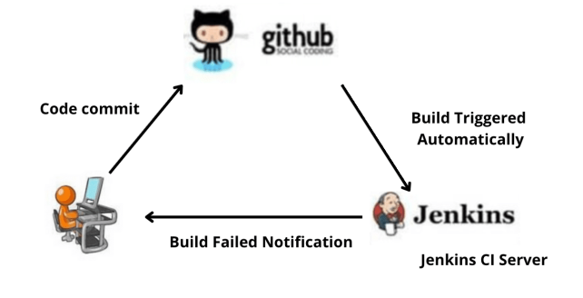
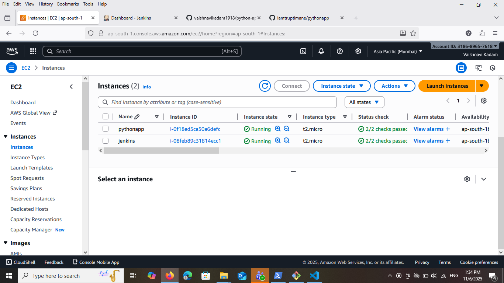
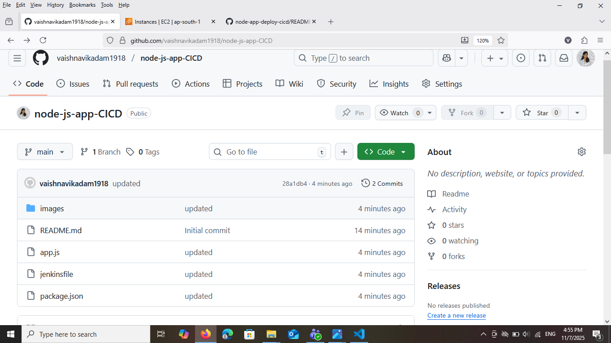
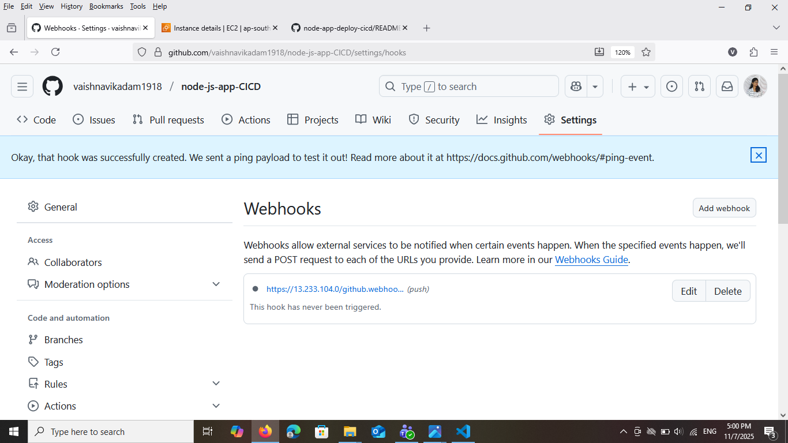
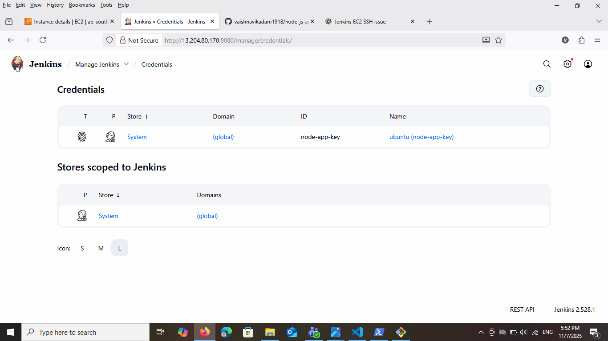
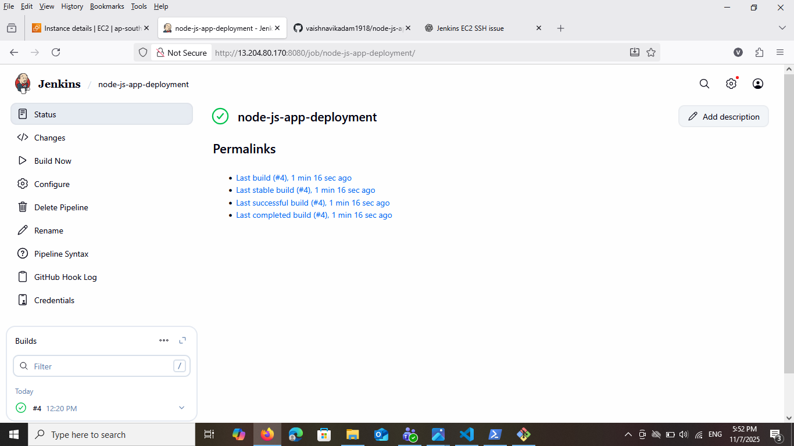

# Node.js App — CI/CD with Jenkins with Webhook
This project demonstrates the __CI/CD (Continuous Integration and Continuous Deployment)__ process for a __Node.js application using Jenkins and GitHub Webhooks__. The pipeline is designed to automatically build, test, and deploy the application whenever new code is pushed to the GitHub repository.

By integrating Jenkins with GitHub, the deployment process becomes completely automated — eliminating manual intervention and ensuring that the latest code changes are always deployed seamlessly. This setup showcases key DevOps practices such as __automation, version control integration, and continuous delivery__, providing a practical example of how modern software teams can achieve faster and more reliable deployments



### What This Project Does
* Automates the deployment of a Node.js application using Jenkins CI/CD.
* Integrates GitHub Webhooks to automatically trigger builds when new code is pushed.
* Pulls the latest source code from the GitHub repository.
* Installs all required Node.js dependencies automatically.
* Builds and tests the application to ensure code quality.
* Deploys the updated application to the target server without manual steps.
* Ensures continuous integration and continuous delivery (CI/CD) for faster, reliable updates.
* Provides a fully automated workflow — from code commit to live deployment.

### Tools & Technologies
* __Jenkins__ – For continuous integration and delivery automation
* __Node.js & npm__ – For building and running the application
* __Git & GitHub__ – For version control and webhook triggers
* __PM2__ – For process management and application restart
* __Linux Server(Ubuntu)__ – For remote deployment and configuration

### Prerequisites

* GitHub repository for your app.
* Jenkins server(Ubuntu) reachable by your Git host and target servers
* Jenkins plugins (at minimum):
  * Pipeline
  * Git 
  * GitHub
  * SSH Agent (for SSH-based deploys)

* Target EC2 server(node) with SSH access 
* Node.js application source code hosted on a Git repository (e.g., GitHub).

### High-level CI/CD Flow

1. Developer pushes code to main (or feature branch).

2. Github webhook triggers Jenkins.

3. Jenkins pulls code, runs npm ci, runs tests.
4. If tests pass, Jenkins builds the app (if there's a build step).

5. Jenkins deploys the new version to the target:

6. SSH into server, install dependencies, restart process (pm2).
7. Post-deploy smoke tests and notifications.

### Step-1: Launch EC2s
Lauch two EC2s in same VPC(default)

* __Jenkins Server__
   * Add port *_8080 in_* Security Group

* __Target Server__
  * Add port *_22_* & *_3000_* in security Group
  * install nodejs, npm and pm2 (manually)
  ```
  sudo apt update
  sudo apt install nodejs npm -y
  sudo npm install -g pm2
  ```


### Step-2: Create Repository on GitHub
* Create a repository on Github
  * Name: `node-app-deploy-cicd`
  * Branch: `main`



* Add __Webhooks__
  * Payload URL : `http://<Jenkin-Server-PUBLIC-IP>:8080/github-webhook/`



### Step-3: Add Credentials

__Manage Jenkins → Credentials → System → Global__:
* Create New Credentails
  * Scope:  Global
  * id: `node-app-key`
  * description: `node-app-key`
  * username: `ubuntu`
  * private key: `Your-Private-Key`



### Step-4: Create Item
* name: `node-app-deploy-cicd`
* item-type: *_Pipeline_*


* Enable Trigger: GitHub hook trigger for GITScm polling
* Defination: Pipeline script from SCM
* SCM: Git
* Repository: `https://github.com/vaishnavikadam1918/node-js-app-CICD.git`
* Branch: main
* Script Path: `Your-jenkinsfile-name`


### Step-5: Write Jenkinsfile
```
pipeline {
    agent any

    environment {
        SERVER_IP      = '<18.215.165.162>' //Replace your node server Pub/Pvt IP
        SSH_CREDENTIAL = 'node-app-key'
        REPO_URL       = 'https://github.com/vaishnavikadam1918/node-js-app-CICD.git'
        BRANCH         = 'main'
        REMOTE_USER    = 'ubuntu'
        REMOTE_PATH    = '/home/ubuntu/node-app'
    }

    stages {
        stage('Clone Repository') {
            steps {
                git branch: "${BRANCH}", url: "${REPO_URL}"
            }
        }

        stage('Upload Files to EC2') {
            steps {
                sshagent([SSH_CREDENTIAL]) {
                    sh """
                        ssh -o StrictHostKeyChecking=no ${REMOTE_USER}@${SERVER_IP} 'mkdir -p ${REMOTE_PATH}'
                        scp -o StrictHostKeyChecking=no -r * ${REMOTE_USER}@${SERVER_IP}:${REMOTE_PATH}/
                    """
                }
            }
        }

        stage('Install Dependencies & Start App') {
            steps {
                sshagent([SSH_CREDENTIAL]) {
                    sh """
                        ssh -o StrictHostKeyChecking=no ${REMOTE_USER}@${SERVER_IP} '
                            cd ${REMOTE_PATH} &&
                            npm install &&
                            pm2 start app.js --name node-app || pm2 restart node-app
                        '
                    """
                }
            }
        }
    }

    post {
        success {
            echo '✅ Application deployed successfully!'
        }
        failure {
            echo '❌ Deployment failed.'
        }
    }
}


```
__NOTE:__ Replace `SERVER_IP`, `SSH_CREDENTIAL`, `REPO_URL`, and `REMOTE_PATH` with your actual values.

### Step-6: Push code and Jenkins file to Repository
push Nodejs application on github repository
```bash
git init
git add .
git commit -m ""
git push -u origin main
```
Now we pushed code to GitHub, a webhook instantly notifies the Jenkins server. Jenkins then automatically pulls the latest code, installs dependencies, runs tests, builds the application, and deploys it to the target server



### Step-7: Browse Application on browser
open browser and enter
```http://<Node-Server-Public-Ip>:3000```


### Conclusion
In conclusion, deploying a __Node.js application using Jenkins CI/CD integrated with GitHub Webhooks__ provides a fully automated, efficient, and reliable deployment pipeline. By connecting GitHub with Jenkins through webhooks, every code push or pull request automatically triggers the build, test, and deployment stages — ensuring faster delivery and reducing manual effort.

This setup improves __code quality__, enhances __team collaboration__, and enables __continuous integration and continuous delivery__ in real-time. Overall, it demonstrates how Jenkins can streamline the entire development lifecycle — from code commit to production — making the Node.js deployment process consistent, scalable, and DevOps-ready.